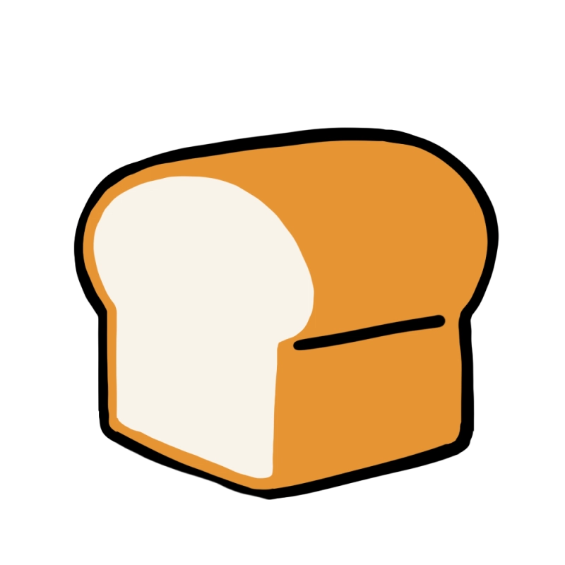

# 중고서적 거래 플랫폼 책빵 📖🍞 !

  

[플레이 데이터] 한화시스템 BEYOND SW캠프
 🥪팀 5VEN

## 😃 팀원 소개

<figure>
    <table>
      <tr>
        <td align="center"></td>
        <td align="center"></td>
        <td align="center"></td>
	<td align="center"></td>
        <td align="center"></td>
      </tr>
      <tr>
        <td align="center">팀장: <a href="https://github.com/daydeiday">곽효림</a></td>
        <td align="center">팀원: <a href="https://github.com/wkdlrn">김재구</a></td>
        <td align="center">팀원: <a href="https://github.com/ChangeunLim" >임찬근</a></td>
        <td align="center"><strong>팀장</strong>: <a href="https://github.com/InukChoi">최인욱</a></td>
	<td align="center">팀원: <a href="https://github.com/choi-won-ik" >최원익</a></td>
      </tr>
    </table>
</figure>

## 📝 프로젝트 소개

> 현대인들은 책을 통해 지식을 얻고 감동을 경험하지만 더 이상 필요하지 않은 책이 쌓여가는 문제를 자주 겪습니다. **중고서적 거래 플랫폼**은 개인과 개인(P2P) 또는 개인과 업자 간의 중고 책 거래를 손쉽게 연결하여 책의 가치를 지속적으로 나눌 수 있는 공간을 제공합니다.

## ⚙️ 화면 설계서
[Figma 화면 설계서](https://www.figma.com/design/isiuYGLjcD6TBkmzs0o2O2/Untitled?node-id=0-1&node-type=canvas&t=lPSvA7gDEsP91Twd-0)
 

## 📧 도메인 주소
[www.breadbook.kro.kr](https://www.breadbook.kro.kr)
 

## 🔎 프로젝트 시연
[프로젝트 시연](https://github.com/beyond-sw-camp/be12-2nd-5ven-bread_book/wiki/%EA%B8%B0%EB%8A%A5-%ED%85%8C%EC%8A%A4%ED%8A%B8)
 

## 🎮 기술 스택
### 기술

&nbsp;
&nbsp;
&nbsp;
&nbsp;
&nbsp;

&nbsp;

### 1. Tailwind CSS
- Vue.js와 Tailwind CSS는 컴포넌트 기반 설계와 유틸리티 클래스를 활용해 빠르고 효율적인 스타일링이 가능
- 디자인 시스템 구축, CSS 충돌 방지, 반응형 디자인 지원, 작은 번들 크기 등으로 생산성과 유지보수성을 극대화 할 수 있다.
### 2. axios
- Axios와 Fetch는 모두 HTTP 요청을 보내는 데 사용되는 도구 이지만, Axios는 Fetch보다 더 편리한 API와 다양한 기능을 제공한다.
- 비동기 작업을 처리하는 데 있어 더 직관적이고 간결한 방식을 지원한다. 
- Fetch를 사용할 경우, 요청 설정 객체를 세부적으로 구성해야 하며, 응답 데이터를 사용하려면 json() 메서드를 호출하여 별도로 데이터를 파싱해야 하는 반면, Axios는 이러한 과정을 자동화하여 개발자가 반복적으로 처리해야 할 작업을 줄여준다. 
- 결과적으로 Axios는 코드의 가독성을 높이고, 간결하고 직관적인 코드를 유지하는 데 큰 도움이 되기에 axios를 사용하기로 결정 했다.
### 3. vite
- Webpack과 같은 기존 빌드 도구는 개발 서버의 시작 시간이 길어질 수 있다.
- 변경될 파일을 번들링하고 전체 리소르를 다시 로드해야 하므로 HMR이 느려질 수 있다. 
- vite는 기본 설정만으로도 대부분의 작업을 처리할 수 있으며, 번들링을 할 때, 은 vite에 비해 더 많은 최적화 작업이 필요할 수 있으므로 vite를 채용하였다.

### 협업

&nbsp;
&nbsp;
&nbsp;
&nbsp;
# cricle-front
